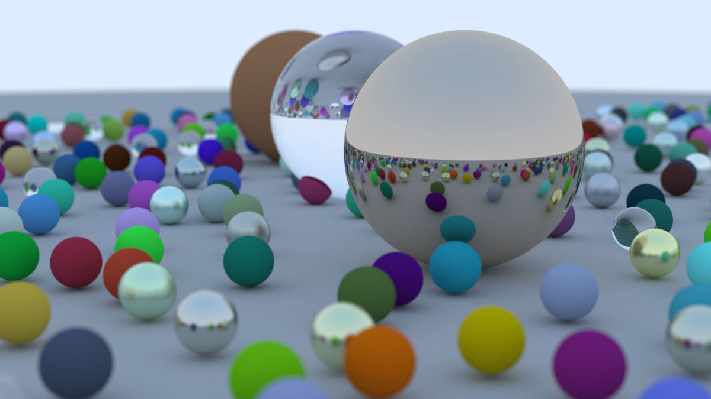

# ray-tracing-in-one-weekend-study-Vulkan

`Ray Tracing in One Weekend` の CPU 版レイトレーサーをもとに、学習目的で Vulkan Compute Shader へ段階的に移植しているリポジトリです。

現在は、Compute Shader 側で次の処理を行います。

- 各ピクセルに対する camera ray 生成
- 複数 sphere の storage buffer 参照
- Lambertian / Metal / Dielectric の簡易 material scatter
- ランダムサンプリング
- 複数 bounce の path tracing
- camera 設定、defocus blur、ランダムシーン生成

詳細な作業メモは `VULKAN_SETUP_NOTES.md` にまとめています。

## 最終レンダリング結果

Vulkan Compute Shader 版で、コピー元の最終シーンに近い構成を元のサンプル数相当でレンダリングしました。



### 計測条件

- 画像サイズ: `1200 x 675`
- Samples per pixel: `500`
- Max depth: `50`
- 球の数: `485`
- Total primary samples: `405,000,000`
- Camera: `lookfrom = (13, 2, 3)`, `lookat = (0, 0, 0)`, `vfov = 20`
- Defocus angle: `0.6`

### 計測結果

`Measure-Command` でアプリ実行全体を 10 回測りました。PPM 書き出し時間も含みます。

```text
1: 16.839163 sec
2: 16.647813 sec
3: 16.338425 sec
4: 16.336989 sec
5: 16.354671 sec
6: 16.415986 sec
7: 16.300708 sec
8: 16.373922 sec
9: 16.250264 sec
10: 16.410027 sec

平均: 16.426797 sec
```

## ビルドと実行

この環境では Visual Studio 2026 Community、Vulkan SDK、`NMake Makefiles` を使ってビルドしています。

```powershell
cmd /c 'call "C:\Program Files\Microsoft Visual Studio\18\Community\Common7\Tools\VsDevCmd.bat" -arch=x64 && cmake -S . -B build_nmake -G "NMake Makefiles"'
```

```powershell
cmd /c 'call "C:\Program Files\Microsoft Visual Studio\18\Community\Common7\Tools\VsDevCmd.bat" -arch=x64 && cmake --build build_nmake'
```

```powershell
.\build_nmake\inOneWeekend.exe --renderer vulkan
```
